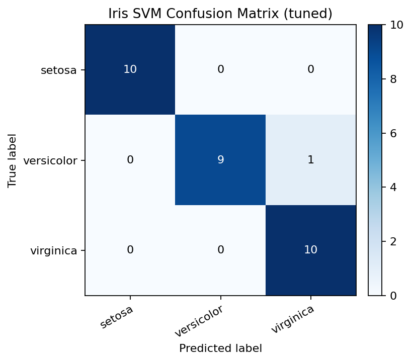
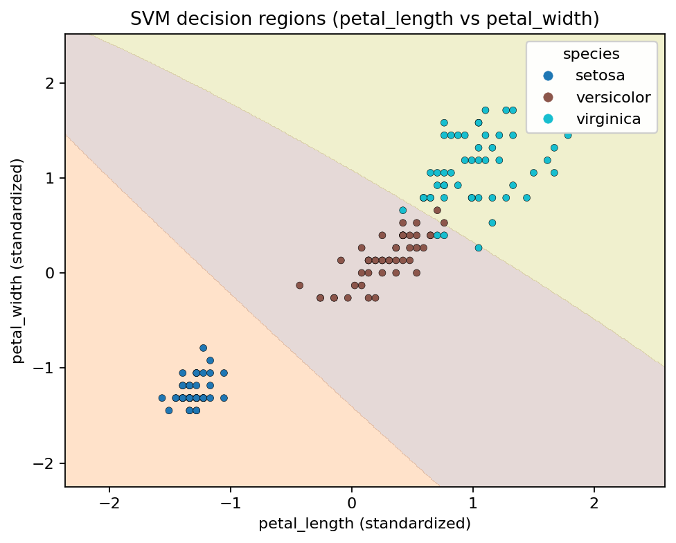

# HW2：Iris（鸢尾花）SVM 分类

姓名：李昱萱

学号：523111910123

## 1. 摘要（Abstract）

本作业使用 Iris 数据集（150 条样本，3 类，每类 50；4 个连续特征），训练 `sklearn.svm.SVC` 完成多分类预测。模型采用 `StandardScaler + SVC` 的 Pipeline，并在 8:2 分层划分（`random_state=42`）、5 折分层交叉验证下，以 `f1_macro` 为评分进行网格搜索调参。

真实运行结果显示：基线模型（`rbf, C=1, gamma=scale`）在测试集达到 `accuracy=0.9667`、`macro F1=0.9666`；网格搜索得到的最优参数为 `rbf, C=1, gamma=0.1`，最佳 CV `macro F1=0.9749`，但在同一 hold-out 测试集上与基线表现相同。

额外对比实验发现：仅使用两维花瓣特征（`petal_length+petal_width`）即可达到 `accuracy=0.9333`，而仅使用萼片两维（`sepal_length+sepal_width`）则下降到 `accuracy=0.7333`，说明花瓣特征对分类贡献更大。

## 关键发现（Key Findings）

- **模型表现**：SVM 在 Iris 上可达到 `accuracy≈0.97`，错分主要发生在 `versicolor` 与 `virginica` 之间。
- **调参结论**：CV 上最优的参数（`rbf, gamma=0.1`）在本次 hold-out 测试上不一定提升，体现“小数据集 + 单次划分”的方差。
- **特征贡献差异**：花瓣特征（petal）远强于萼片特征（sepal）；二者混合效果最好。

## 2.SVM 向量机原理

支持向量机的目标是学习一个分类边界，使不同类别样本到边界的**间隔（margin）尽可能大**，从而提升泛化能力。线性可分时，它寻找一个超平面 $f(x)=w^Tx+b$ 来分开类别，并通过最大化间隔等价地控制模型复杂度（与 $\|w\|$ 相关）。

实际数据往往不可完全分开，因此使用**软间隔（soft margin）**：允许部分样本越界/错分，并用超参数 **$C$** 控制“错分惩罚”和“间隔大小”之间的折中（$C$ 越大越贴合训练集，过拟合风险更高；$C$ 越小边界更平滑，可能欠拟合）。

当线性边界不足以分开类别时，SVM 通过**核技巧（kernel trick）**在隐式高维空间中做线性分割。其中 RBF 核 $K(x,x')=\exp(-\gamma\|x-x'\|^2)$ 用 **$\gamma$** 控制相似度随距离衰减的速度。最终分类只由少数“最关键”的样本点（支持向量）决定。

## 3. 数据与预处理

### 3.1 数据概览

- 样本数：150
- 类别数：3（`setosa / versicolor / virginica`），每类 50
- 特征列：`sepal_length, sepal_width, petal_length, petal_width`
- 标签列：`species`

### 3.2 训练/测试集划分

- `train:test = 8:2`
- `stratify=y` 分层抽样，尽量保持三类比例一致
- `random_state=42`

## 4. 模型与调参

### 4.1 SVM 模型

使用 `sklearn.svm.SVC`

### 4.2 网格搜索（GridSearchCV）

- 交叉验证：`StratifiedKFold(n_splits=5, shuffle=True, random_state=42)`
- 指标：`scoring=f1_macro`
- 搜索空间：
	- `rbf`: `C ∈ {0.1,1,10,100}`, `gamma ∈ {scale, 0.01, 0.1, 1}`
	- `linear`: `C ∈ {0.1,1,10,100}`
	- `poly`: `C ∈ {0.1,1,10}`, `gamma ∈ {scale,0.01,0.1}`, `degree ∈ {2,3,4}`

## 5. 模型评估与可视化

### 5.1 测试集指标（真实运行结果）

- Baseline（`rbf, C=1, gamma=scale`）测试集：
	- `accuracy = 0.9667`
	- `macro F1 = 0.9666`
- GridSearchCV 最优参数：`rbf, C=1, gamma=0.1`
	- 最佳 CV `macro F1 = 0.9749`
	- 在本次测试集上：`accuracy = 0.9667`，`macro F1 = 0.9666`（与 baseline 相同）

### 5.2 混淆矩阵（Confusion Matrix）

调参后的测试集混淆矩阵：

主要错分来自 `versicolor ↔ virginica` 的边界（这两类在特征空间更接近），`setosa` 基本可被稳定识别。

### 5.3 二维决策边界可视化

我在 **全数据** 的 `petal_length × petal_width` 平面上训练一个二维 SVM，并绘制其决策区域

## 6. 发现与讨论

### (1) 花瓣特征几乎决定了可分性

在相同划分（`test_size=0.2, random_state=42, stratify=y`）下，对比不同特征子集的基线 SVM（`rbf, C=1, gamma=scale`）：

| 特征集合 | 包含特征 | 测试集 accuracy | 测试集 macro F1 |
|---|---|---:|---:|
| all_4 | sepal(2)+petal(2) | 0.9667 | 0.9666 |
| sepal_2 | sepal_length+sepal_width | 0.7333 | 0.7306 |
| petal_2 | petal_length+petal_width | 0.9333 | 0.9333 |

**仅用两维花瓣特征就能达到很高准确率**，而萼片特征信息量相对不足；把 4 维一起用能进一步减少 `versicolor/virginica` 的错分。

### (2) “CV 更优”不一定“测试更优”

Iris 数据总体很小（150），测试集只有 30 个样本，因此一次固定 hold-out 的指标会有波动。网格搜索在 CV 上更优，说明它在训练集内部更稳健，但不保证在单次测试划分上必然提升；这也提示如果要更稳健地比较两个配置，应采用重复划分或嵌套交叉验证。

### (3) 并列最优与选择偏好

本次 Top-k 中出现多组参数 CV 均值并列（rank=1）。这说明在 Iris 上 SVM 的最优超参数并不“尖锐”，而是存在一段相对平坦的优区间；实践中可以选择更简单/更稳定的配置，而不必过度追逐微小的 CV 提升。
